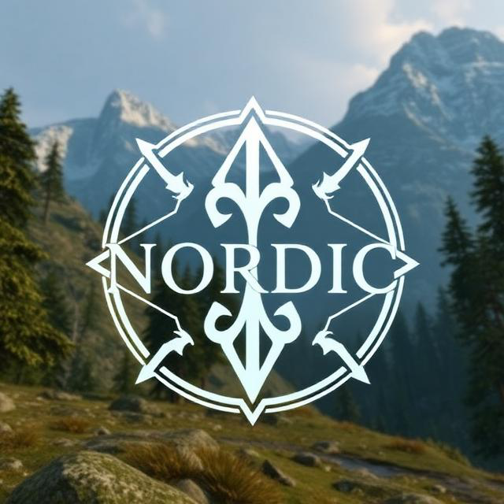

# Nordic Gleam Core
*A Nymph Nerds Production*

## Description
**Nordic Gleam Core** reimagines Skyrim through a *lore-friendly, survival-focused lens*.  
Built for players who crave challenge and immersion, this list enhances the vanilla experience with **PBR visuals**, **upscaled assets**, and **minimal landscape edits**—keeping Skyrim's soul intact while bringing it into a new generation.  
Expect tougher hunting, harsher survival, and subtle world changes that make everything feel *fresh yet familiar*.

---

## 📚 Guides Hub

We've written clear step-by-step guides to help you install and customize Nordic Gleam Core.

👉 **[Start here: Guides Hub](https://github.com/CageTV/Nordic-Gleam-Core/blob/main/.github/GUIDES.md)**

### Current Guides:
- **[Installation Guide](https://github.com/CageTV/Nordic-Gleam-Core/blob/main/.github/INSTALLATION.md)** — Complete walkthrough for setting up Nordic Gleam Core  
- **[CS Guide](https://github.com/CageTV/Nordic-Gleam-Core/blob/main/.github/CSGUIDE.md)** — Customization and Settings guide  
- **[Performance Guide](https://github.com/CageTV/Nordic-Gleam-Core/blob/main/.github/PERFORMACE.md)** — Optimization tips for your system  
- **[ParallaxGen Guide](https://github.com/CageTV/Nordic-Gleam-Core/blob/main/.github/PARALLAXGEN.md)** — Parallax mapping setup and configuration  

> More guides are coming soon — this section will grow as the list evolves!

---

## Things To Do
- Survive the northern wilderness using food, warmth, and skill.  
- Earn your keep through hunting, crafting, and trade.  
- Experience new environmental storytelling through subtle world tweaks.  
- Discover enhanced visual fidelity while keeping lore and atmosphere intact.  
- Push through Nordic trials to master a more punishing yet rewarding Skyrim.

---

## 🛠️ System Requirements

### Game Version
Requires **Skyrim Anniversary Edition 1.6.1170 (Full AE)**

| | **Minimum (1080p)** | **Recommended (1440p+)** |
|---|---|---|
| **CPU** | Intel 10th Gen / Ryzen 5 or higher | Intel 13th Gen / Ryzen 7600X or higher |
| **GPU** | NVIDIA RTX 3060 Ti 8GB / Radeon RX 6800 or higher | NVIDIA RTX 4070 Ti 12GB / Radeon RX 7900XT or higher |
| **RAM** | 32 GB System RAM | 32 GB System RAM |
| **Storage** | SSD/NVME - 190GB Install, ~102GB Downloads | SSD/NVME - 190GB Install, ~102GB Downloads |

---

## System Preparation

Before running Wabbajack, prepare your system to ensure stability and compatibility:

1. **Increase your Windows pagefile** (≥ 20 GB recommended) to improve stability.  

2. **Install required dependencies:**
   - Latest **Visual C++ Redistributables**  
   - **.NET 4.8, .NET 8, and .NET 9** (required for Wabbajack)

3. **Configure antivirus:** Exclude your Wabbajack and Skyrim folders from antivirus scanning.  

4. **Steam Settings & Skyrim SE Setup:**
   - First, **install Skyrim Special Edition** via Steam if you haven't already.  
   - **Launch Skyrim SE once** to download all **Creation Club content**. Wait for the main menu to appear.  
   - **Close Skyrim SE** completely.  
   - **Verify game files:** In your Steam Library, right-click *Skyrim SE* → *Properties* → *Installed Files* → **Verify integrity of game files**. Wait for verification to complete.  
   - **Configure Steam Settings:**
     - Disable the Steam Overlay  
     - Set game language to **English**  
     - Disable Steam Cloud Saves  
     - Right-click *Skyrim SE* → *Properties* → *Updates* → set to **"Only update this game when I launch it"**  
   - Your **Skyrim SE Steam folder is now ready** for Wabbajack installation.

---

## Installation Guide (Wabbajack)
Follow these steps to install Nordic Gleam Core using **Wabbajack**:

1. Download the latest version of **[Wabbajack](https://www.wabbajack.org/)**.  
2. Create two folders: one for **installation** and another for **downloads** (avoid placing them in Program Files).  
3. Open Wabbajack, log in to Nexus Mods when prompted, and locate **Nordic Gleam Core** in the Modlist Gallery.  
4. Choose your **install** and **downloads** directory paths.  
5. Click **Start/Run** and allow the process to complete.  
6. If prompted to manually download mods, use the provided links (see below).  
7. Once complete, follow the post-installation instructions on screen.  

After installation, launch the game through **ModOrganizer2** located in your installation folder.

---

## Additional Manual Downloads
These files must be downloaded manually and placed in your Wabbajack **downloads** folder before installation:

- [Dodge MCO DXP v2.1.21](https://www.distaranimation.com/s/Dodge-MCO-DXP-v2121.zip)  
- [SkyBirds SSE Edition v1.20](https://www.dropbox.com/scl/fi/tcbysvimqxajud8kp0bch/skyBirds-SSE-Edition-v1.20.7z?e=3&file_subpath=%2FData&rlkey=ts21h3253wspto4qe2htb4uh1&dl=0)

---

## 📋 Updates & Changelog

Track all updates, bug fixes, and changes to Nordic Gleam Core:

- **[Changelog](./changelog.md)** — Detailed list of all version updates, features added, mods updated, and fixes applied  
- **[Versions](./versions.json)** — Machine-readable version history and metadata for automated tools  

Check these files regularly to stay informed about improvements and new features!

---

## Current Status
**Status:** Alpha  
**License:** [MIT License](./LICENSE)  
**Discord:** [Join the Nymph Nerds Community](https://discord.gg/V6qa82Spxw)  
**Download:** Available on [Nexus Mods](https://www.nexusmods.com/)  

> *A collaborative Skyrim modlist — immersive, magical, and consent-driven.*  
> **Questions, comments, or support?** Join our [Discord Server](https://discord.gg/V6qa82Spxw).

---

## 👥 Contributors & Credits

**Built with 💚 by babyjaws, Rauty79, & Julio005 — Nymph Nerds Production**

Nordic Gleam Core would not exist without the creativity and hard work of the Skyrim modding community.

### Core Team
- **babyjaws** — List development & curation  
- **Rauty79** — Design & coordination  
- **Julio005** — List development & curation  

### Special Thanks
Enormous thanks to our dedicated testers and supporters who helped shape this list:
- **backbeatN, Nyx, dbottle, Dlizzio, HerrSchtevie** — Testing, feedback, and invaluable support  
- **Discord Community** — Constant encouragement, ideas, and engagement  

### Acknowledgements
- The **Wabbajack Team** for developing the automation tools that make this possible.  
- **Bethesda Game Studios** for the foundation we continue to expand upon.  
- **All mod authors** whose creations enrich this list and keep Skyrim thriving 🌿  

If your mod or work is featured in this list and you would like to be credited directly, please open an issue or reach out on Discord.

---
